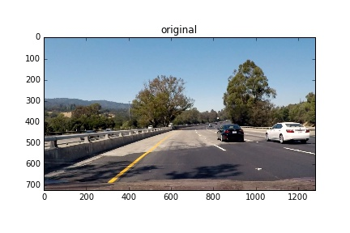
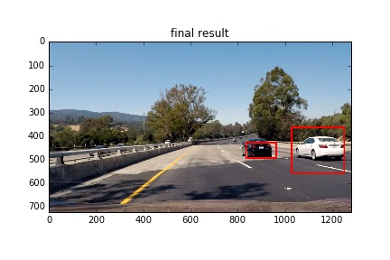

# Vehicle Detection and Tracking Udacity-SDC-T1-P5

##Histogram of Oriented Gradients (HOG)

Explain how (and identify where in your code) you extracted HOG features from the training images. Explain how you settled on your final choice of HOG parameters.

The HOG features get extracted in line 30-40 in file image_processing.py. In the lectures we use 64x64 px images but in my code I use 32x32 images because during testing I could not observe more accuracy when detecting cars when using 64px images compared to 32px images. 

The HOG parameters are 
9 orientations. I sues this as it is recommended to chose between 6 and 12, so 9 is a middle value
I use 8 pixels per cell
I use 2 cells per block. 

I tested HOG with RGB and various channels as well as using all channels. Then I used HLS because I made good experiences with HLS in the previous project. I use the S-channel for HOG. I have no statistical prove, but from my observations of the end result in the videos using the S channel of HLS gave me best results. 

##Training

I perform the training in the file training.py in lines 22 to 128. First I loop through all folders containing vehicle and non-vehicle images and load the PNG files. For each PNG file I extract the features using the method image_to_featureset() in line 67. The features also get normalized in line 105. I then add the features to an array so that I have at the end a complete dataset. I save it as a pickle file so that I don't have to go through this process all the time. 

The I shuffle the dataset and split it in a training and test dataset - line 111 to 113.

In line 115 to 127 I load the dataset into a SVM and train it. I do this only if there is no model pickle file already. This prevents that I have to do the training every time when I run the prediction of images. 

In line 130 I check the accuracy of prediction using the test dataset and the accuracy is around 99%. 

##Sliding Window Search

The process of processing one input image begins in line 223 in file training.py with the function process_video(img). We can see in line 225 that I use 4 scales of windows with 64, 128, 196 and 256 pixel. The reasons for choosing these values are: 

Using smaller than 64px images consumes a lot of CPU power and we don't necessarily need to detect cars that are smaller than 64px. 
256px is enough to detect the biggest cars. There is no need to chose larger than 256px areas. 
We need to keep the number of different scales low as it uses a lot of CPU power. My assumption was that the SVM can detect a car with a tolerance of +/- 50% of the car. This would mean that we only need a window when the car doubles its size. Based on that it would be ok to have scales of 64px, 128px, 256px. However, I observed in the video situations where the algorithm stopped detecting the car although nothing changed except its size. I concluded that my assumption was not right and I added the 196px step to close the gap. 

I used 50% overlap because i thought that it is sufficient. However, I have now some doubt if this is true because in the video at one point the white car is suddenly not detected anymore. And I don’t know why. At this moment the only thing that changes is the position of the car on the image - not the size or the lightning. It might be that the car falls between two sliding windows and cannot be detected. 

Here I show the main steps of the pipeline

I realized that the accuracy percentage when training the SVM is quite meaningless when we look at the end result of the video. I made the same observation in previous projects. The method I used to assess the accuracy of the final result is subjective impression. My assumption was that 99% accuracy of the SVM is enough. So, the problem of false positives and other mistakes lies somewhere else. Therefore I experimented with different color spaces and combinations of feature sets. Also, I tried various parameters for the false positive detection via heatmap. For the video stream I include in the heatmap several images and it turned out that this helps quite a lot. A good result for filtering out false positives is to include 6 images and then set the threshold for the heatmap to 18, meaning across 6 images we need 18 indications that a certain area contains a car image.   

##Video Implementation

The final output of the video can be found in the subdirectory output_video/ and file ./video/project_video_output.mp4 

[LINK TO VIDEO (./video/project_video_output.mp4) ](./video/project_video_output.mp4)

The video processing is being performed using the function rocess_video(img) in training.py. In line 231 to 251 we first identify the boxes that contain vehicle images. To do that we apply the sliding window approach in line 231 to 244. The prediction itself happens in line 239 in training.py

Unfortunately we have to deal with a lot of false positives. To reduce the false positives we perform a filtering via heatmap. First we add all detected vehicles to a queue in line 241. The usage of a queue allows calculating the heatmap across various images. In line 251 I then retrieve all boxes visible in 6 images and apply the threshold for the heatmap. 

##Discussion

I did not face major obstacles during implementation. But what I find frustrating is that it is not clear which parameters to tune to improve performance. I can spend many hours trying to tune parameters and still do not see a clear improvement. I think there must be a better approach to this. For example we could create an optimizer that automatically creates many videos using different combinations of parameters. Such an optimizer could then run for 2 days and afterwards I could just check which video performs best.  

In terms of optimization i think there must be something more efficient than the sliding window approach the way I implemented it. For example, I could imagine an improvement like this: We start with the biggest window size and if we identified a car, then we don't need to go over the same area with a much smaller resolution of the sliding window. Two sizes could be enough. This would reduce processing time. 

My pipeline is clearly not ready for usage in the real world. First of all it is too slow. Second, I have the feeling that the accuracy of detection is not high enough. For example sometimes there are two cars but the algorithm things it is one car. So, keeping the cars separated is an issue. Also, the video we concentrate on the cars positioned on the right side. But on the left lane are also cars and it is strange to me that they are not at all identified. They are small of course but I think my 64px frame could have identified them. 

